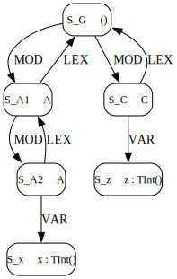

## [`ModulesNestedSame.lm`](examples/ModulesNestedSame.lm)


### Program
```
module A {
  def x:int = 1
  module A {
    def x:int = 2
  }
}

module C {
  import A
  import A
  def z:int = x
}
```


### AST
```
-- TODO
```


### Scope graph

###### Textual
```
-- global scope
S_G = scope()
S_G -[ `MOD ]-> S_C
S_G -[ `MOD ]-> S_A1

-- module C scope
S_C = scopeDatum(datumMod("C", S_G))
S_C -[ `LEX ]-> S_G
S_C -[ `VAR ]-> S_z
S_C -[ `IMP ]-> ???

-- var z scope
S_z = scopeDatum(datumVar("z", ???))

-- outer module A scope
S_A1 = scopeDatum(datumMod("A", S_A1))
S_A1 -[ `LEX ]-> S_G
S_A1 -[ `MOD ]-> S_A2

-- inner module A scope
S_A2 = scopeDatum(datumMod("A", S_A2))
S_A2 -[ `LEX ]-> S_A1
S_A2 -[ `VAR ]-> S_x

-- var x scopes
S_x1 = scopeDatum(datumVar("x", INT))
S_x2 = scopeDatum(datumVar("x", INT))
```

###### Drawing


### Statix issues
A Statix query cannot go ahead if there are any weakly critical edges for that query present in the scope graph. I.e., missing edges which [theoretically] can be filled in by other queries. The presence of `import A` in module `C` means that there is a weakly critical edge from `S_C` to another scope, either `S_A1` or `S_A2`. However, the only query which could ever extend the current scope graph with this edge is itself the `import A` query. Therefore we have a situation where the `import A` query can only go ahead when it has itself finished, meaning the query can never start. This issue is the same as that encountered in even more simple examples, where there is no question about ambiguity.

### Resolution of `x`

**NOTE:** The resolution below and in the spec makes use of a function `minRef` that I have not defined yet. The purpose of this function is to take a list of `Res` nodes and filter out those that are not in the minimal path set, with respect to the LM label ordering. This is the same as the `minref` used in the Statix specs. It's type as I've been using is `[Scope] ::= [Res]`.

#### DFA
```
state0 {
  --LEX-> state0
  --IMP-> state1
  --VAR/MOD-> state2
}

state1 {
  -- VAR -> state2
}

state2 (final) {}

sink {}
```

#### Resolution trace for local attribute `res` for `VarRef("x")`
```
minRef(dfaVarRef.findReachable(x, VarRef("x"), [], S_C), top)
  dfaVarRef.findReachable(x, VarRef("x"), [], S_C)
    S_C.vars
      Contains [S_z]
        state2.findReachable("x", VarRef("x"), [labelVar()], S_z)
          S_z datum does not match.
            Return []
    _union_
    S_C.imps
      See "Evaluation of `S_C.imps`" below
      Returns [S_A1, SA_2]
        state1.findReachable("x", VarRef("x"), [labelImp()], S_A1)
          S_A1.vars
            No contributions. Return []
          _union_
          S_A1.imps
            Transitions to sink state. Return []
          _union_
          S_A1.lexs
            Transitions to sink state. Return []
          = []
        state1.findReachable("x", VarRef("x"), [labelImp()], S_A2)
          S_A2.vars
            Contains [S_x]
              state2.findReachable("x", VarRef("x"), [labelImp(), labelVar()], S_x)
                S_x.vars
                  Transitions to sink state. Return []
                _union_
                S_x.mods
                  Transitions to sink state. Return []
                _union_
                S_x.imps
                  Transitions to sink state. Return []
                _union_
                S_x.lexs
                  Transitions to sink state. Return []
                _union_
                S_x datum matches.
                  Return [S_x]
          _union_
          S_A2.imps
            Transitions to sink state. Return []
          _union_
          S_A2.lexs
            Transitions to sink state. Return []
          = [S_x]
    _union_
    S_C.lexs
      Contains [S_G]
        state0.findReachable("x", VarRef("x"), [labelLex()], S_G)
          S_G.vars
            No contributions. Return []
          _union_
          S_G.imps
            Transitions to sink state. Return []
          _union_
          S_G.lexs
            No contributions. Return []
          = []
    = [S_x]
  Return [S_x]
Return [S_x]
```


##### Evaluation of `S_C.imps`
```
S_C.imps <- minRef(scope.impsReachable, "A")
  See "Evaluation of `S_C.impsReachable`" below
Return [S_A2, S_A1]
```

###### Evaluation of `S_C.impsReachable`

```
-- Before iteration 1, S_C.impsReachable = []

dfaModRef.findReachable("A", ModRef("A")_1, [], S_C)                  -- iteration 1
  state0.findReachable("A", ModRef("A")_1, [], S_C)
    S_C.mods
      No contributions. Return []
    _union_
    S_C.impsReachable
      Circular use. Return []                                         -- using current value of S_C.impsReachable
    _union_
    S_C.lexs
      Contains [S_G]
      state0.findReachable("A", ModRef("A")_1, [labelLex()], S_G)
        S_G.mods
          Contains [S_C, S_A1]
          state2.findReachable("A", ModRef("A")_1, [labelMod()], S_C)
            S_C.mods
              Transitions to sink state. Return []
            _union_
            S_C.impsReachable
              Transitions to sink state. Return []
            _union_
            S_C.lexs
              Transitions to sink state. Return []
            _union_
            S_C datum does not match.
              Return []
            = []
          _union_
          state2.findReachable("A", ModRef("A")_1, [labelMod()], S_A1)
            S_A1.mods
              Transitions to sink state. Return []
            _union_
            S_A1.imps
              Transitions to sink state. Return []
            _union_
            S_A1.lexs
              Transitions to sink state. Return []
            _union_
            S_A1 datum matches. 
              Return [S_A1]
            = [S_A1]
          = [S_A1]
        _union_
        S_G.imps
          No contributions. Return []
        _union_
        S_G.lexs
          No contributions. Return []
        = [S_A1]
    = [S_A1]
Return [S_A1]
_union_
dfaModRef.findReachable("A", ModRef("A")_2, [], S_C)
  state0.findReachable("A", ModRef("A")_2, [], S_C)
    S_C.mods
      No contributions. Return []
    _union_
    S_C.impsReachable
      Circular use. Return []                                             -- using current value of S_C.impsReachable
    _union_
    S_C.lexs
      Contains [S_G]
      state0.findReachable("A", ModRef("A")_2, [labelLex()], S_G)
        S_G.mods
          Contains [S_C, S_A1]
          state2.findReachable("A", ModRef("A")_2, [labelMod()], S_C)
            S_C.mods
              Transitions to sink state. Return []
            _union_
            S_C.impsReachable
              Transitions to sink state. Return []
            _union_
            S_C.lexs
              Transitions to sink state. Return []
            _union_
            S_C datum does not match.
              Return []
            = []
          _union_
          state2.findReachable("A", ModRef("A")_2, [labelMod()], S_A1)
            S_A1.mods
              Transitions to sink state. Return []
            _union_
            S_A1.imps
              Transitions to sink state. Return []
            _union_
            S_A1.lexs
              Transitions to sink state. Return []
            _union_
            S_A1 datum matches. 
              Return [S_A1]
            = [S_A1]
          = [S_A1]
        _union_
        S_G.imps
          No contributions. Return []
        _union_
        S_G.lexs
          No contributions. Return []
        = [S_A1]
    = [S_A1]
Return [S_A1]

-- Both `import A`s return S_A1. But we only keep one of them. Say, the one from resolving ModRef("A")_1
-- i.e. remove duplicate 
-- Before iteration 2, S_C.impsReachable = [S_A1]                     -- from different refs

dfaModRef.findReachable("A", ModRef("A")_1, [], S_C)                  -- iteration 2
  state0.findReachable("A", ModRef("A")_1, [], S_C)
    S_C.mods
      No contributions. Return []
    _union_
    S_C.impsReachable                                                     -- using current value of S_C.impsReachable
      Contains [S_A1_1, SA_1_2], but local `valid` contains [SA_1_2] since S_A1_1 was introduced by state1.state1.findReachable("A", ModRef("A")_2, [labelImp()], S_A1_2)
        S_A1_2.mods
          Contains [S_A2]
          state2.findReachable("A", ModRef("A")_1, [labelLex(), labelMod()], S_A2)
            Datum for S_A2 matches. Return [S_A2]
        _union_
        S_A1_2.imps
          Transitions to sink state. Return []
        _union_
        S_A1_2.lexs
          Transitions to sink state. Return []
        = [S_A2]
    _union_
    S_C.lexs
      Contains [S_G]
      state0.findReachable("A", ModRef("A")_1, [labelLex()], S_G)
        S_G.mods
          Contains [S_C, S_A1]
          state2.findReachable("A", ModRef("A")_1, [labelLex(), labelMod()], S_C)
            S_C.mods
              Transitions to sink state. Return []
            _union_
            S_C.impsReachable
              Transitions to sink state. Return []
            _union_
            S_C.lexs
              Transitions to sink state. Return []
            _union_
            S_C datum does not match. 
              Return []
            = []
          _union_
          state2.findReachable("A", ModRef("A")_1, [labelLex(), labelMod()], S_A1)
            S_A1.mods
              Transitions to sink state. Return []
            _union_
            S_A1.impsReachable
              Transitions to sink state. Return []
            _union_
            S_A1.lexs
              Transitions to sink state. Return []
            _union_
            S_A1 datum matches.
              Return [S_A1]
            = [S_A1]
        _union_
        S_G.imps
          No contributions. Return []
        _union_
        S_G.lexs
          No contributions. Return []
        = [S_A1]
    = [S_A1]
Return [S_A2_1, S_A1_1]
_union_
dfaModRef.findReachable("A", ModRef("A")_2, [], S_C)
  state0.findReachable("A", ModRef("A")_2, [], S_C)
    S_C.mods
      No contributions. Return []
    _union_
    S_C.impsReachable                                                     -- using current value of S_C.impsReachable
      Contains [S_A1_1, SA_1_2], but local `valid` contains [SA_1_1] since S_A1_2 was introduced by state1.state1.findReachable("A", ModRef("A")_2, [labelImp()], S_A1_1)
        S_A1_1.mods
          Contains [S_A2]
          state2.findReachable("A", ModRef("A")_2, [labelLex(), labelMod()], S_A2)
            Datum for S_A2 matches. Return [S_A2]
        _union_
        S_A1_1.imps
          Transitions to sink state. Return []
        _union_
        S_A1_1.lexs
          Transitions to sink state. Return []
        = [S_A2]
    _union_
    S_C.lexs
      Contains [S_G]
      state0.findReachable("A", ModRef("A")_2, [labelLex()], S_G)
        S_G.mods
          Contains [S_C, S_A1]
          state2.findReachable("A", ModRef("A")_2, [labelLex(), labelMod()], S_C)
            S_C.mods
              Transitions to sink state. Return []
            _union_
            S_C.impsReachable
              Transitions to sink state. Return []
            _union_
            S_C.lexs
              Transitions to sink state. Return []
            _union_
            S_C datum does not match. 
              Return []
            = []
          _union_
          state2.findReachable("A", ModRef("A")_2, [labelLex(), labelMod()], S_A1)
            S_A1.mods
              Transitions to sink state. Return []
            _union_
            S_A1.impsReachable
              Transitions to sink state. Return []
            _union_
            S_A1.lexs
              Transitions to sink state. Return []
            _union_
            S_A1 datum matches.
              Return [S_A1]
            = [S_A1]
        _union_
        S_G.imps
          No contributions. Return []
        _union_
        S_G.lexs
          No contributions. Return []
        = [S_A1]
    = [S_A1]
Return [S_A2_2, S_A1_2]

-- After iteration 2, S_C.impsReachable = [S_A2_1, S_A1_1, S_A2_1, S_A1_2]
-- Same result as previous iteration, terminate.
```