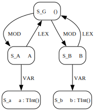

# Statix-LM Issue with Imports

## Program

```
module A {
  def a = 1
}

module B {
  import A
  def b = a
}
```

## Original spec aterm

The above program as an abstract term satisfying the [abstract syntax of the original LMR specification](statix-spec/lmr-original.mstx).

```
Program(
  "ModulesSimple",
  [
    Module(
      "A", 
      [
        Def(
          DefBind(
            "a", 
            Int("1")
          )
        )
      ]
    ), 
    Module(
      "B", 
      [
        Import(
          ModRef("A")
        ), 
        Def(
          DefBind(
            "b", 
            Var(
              VarRef("a")
            )
          )
        ) 
      ]
    )
  ]
)
```

## Tree-ified spec aterm

The above program as an abstract term using [our tree-ified abstract syntax](statix-spec/statix-spec.mstx).

```
Program(
  DeclsCons(
    DeclModule(
      "A", 
      DeclsCons(
        DeclDef(
          DefBind(
            "a", 
            ExprInt("1")
          )
        ), 
        DeclsNil()
      )
    ), 
    DeclsCons(
      DeclModule(
        "B", 
        DeclsCons(
          DeclImport(
            ModRef("A")
          ), 
          DeclsCons(
            DeclDef(
              DefBind(
                "b", 
                ExprVar(
                  VarRef("a")
                )
              )
            ), 
            DeclsNil()
          )
        )
      ), 
      DeclsNil()
    )
  )
)
```

## Initial scope graph



## MiniStatix issues

See penultimate paragraph of section 6 of Knowing When to Ask.

MiniStatix gets stuck on LM programs that have imports, even those where the import is non-ambiguous. The query to resolve an import and the edge assertion it results in originate from the same scope, the importing module. However, due to the nature of imports in LM (whose regex is `LEX* IMP? MOD`), the edge assertion becomes *weakly critical* for the query. Therefore the query is delayed on the weakly critical edge assertion, which in turn is waiting for the query to resolve the target of the edge assertion. No more steps can be taken at this point. This shows the over-approximation of dependencies using weakly critical edges, since it may lead to the operational semantics becoming stuck on seemingly trivial programs.