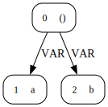
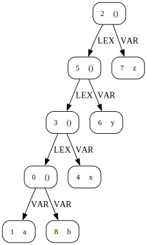
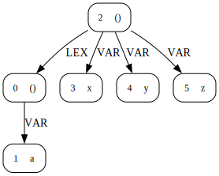

# LMR 0

- LMR 0: LMR without modules, imports and records

### Resolution semantics

Forward referencing of variable names is allowed. There is a single global scope
which is treated the same as the body of a recursive `let` where all variables
in the program are treated as binders of it.

### Directories:

- `tests/`: LM example tests directory at `../grammars/lm_syntax_0/tests`.

- `out/`: created by the LM compiler if files are generated.

- `lmr/nameanalysis1`: name analysis with older scope graphs library, using
  inherited list attributes for all LMR edge types. Language coupled.

- `lmr/nameanalysis2`: uses newer scope graphs library with one inherited
  attribute for edges, a list of `Edge` nodes - one production of this type for
  each edge type needed for the language. Less language coupled.

- `lmr/nameanalysis3`: draft sketch of what scope graph-based name analysis may
  look like with a Silver extension with constraint-like equations for scope
  graph assertions and queries.

- `lmr/nameanalysis4`: draft skets of what scope graph-based name analysis may
  look like with JastAdd style collection attributes. Edge assertions in
  `nameanalysis3` become contributions to collection attributes on scopes.
  Contributions are to individual edge attributes as seen in `nameanalysis1`.

### Execution:
```bash
./compile
java -jar lmr0.lmr.driver.jar tests/letseq.lm
./clean
```

### Example scope graphs:

#### [`forwardvarref.lm`](./tests/forwardvarref.lm)



#### [`letseq.lm`](./tests/letseq.lm)



#### [`letpar.lm`](./tests/letpar.lm)



### Concrete Syntax:
```
terminal Int_t /0|[1-9][0-9]*/;
terminal VarId_t /[a-z][a-zA-Z_0-9]*/

Main_c ::=
  Decls_c

Decls_c ::=
  Decl_c Decls_c
  |

Decl_c ::=
  'def' ParBind_c

Expr_c ::=
    Int_t
  | 'true'
  | 'false'
  | VarRef_c
  | Expr_c '+' Expr_c
  | Expr_c '-' Expr_c
  | Expr_c '*' Expr_c
  | Expr_c '/' Expr_c
  | Expr_c '&' Expr_c
  | Expr_c '|' Expr_c
  | Expr_c '==' Expr_c
  | Expr_c '$' Expr_c
  | 'if' Expr_c 'then' Expr_c 'else' Expr_c
  | 'fun' '(' ArgDecl_c ')' '{' Expr_c '}'
  | 'let' SeqBinds_c 'in' Expr_c
  | 'letrec' ParBinds_c 'in' Expr_c
  | 'letpar' ParBinds_c 'in' Expr_c
  | '(' Expr_c ')'

SeqBinds_c ::=
    SeqBind_c ',' SeqBinds_c
  | SeqBind_c
  |

SeqBind_c ::=
    VarId_t '=' Expr_c
  | Type_c ':' VarId_t '=' Expr_c

ParBinds_c ::=
    ParBind_c ',' ParBinds_c
  |

ParBind_c ::=
    VarId_t '=' Expr_c
  | Type_c ':' VarId_t '=' Expr_c

ArgDecl_c ::=
    VarId_t ':' Type_c

Type_c ::=
    'int'
  | 'bool'
  | Type_c '->' Type_c
  | '(' Type_c ')'

VarRef_c ::=
    VarId_t
```