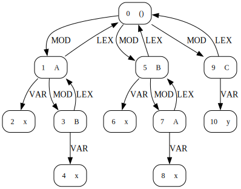

# LMR 3

- LMR 3: LMR without modules, imports and records

### Resolution semantics

Same as in Ministatix LMR ([web link here](https://github.com/MetaBorgCube/metaborg-lmr/blob/d1cb439be8eba9468d95cfc0aa091558147a227d/lang.lmr.mstx/src/lmr.mstx)). Forward referencing of all names is allowed, and
imports are self-influencing. In both Ministatix and (non-circular) reference
AGs, imports are erroneous. For Ministatix, constraint solving becomes stuck.
In RAGs, there are circular dependencies.

### Directories:
- `tests/`: LM example tests directory at `../grammars/lm_syntax_0/tests`.
- `out/`: created by the LM compiler if files are generated.

### Execution:
```bash
./compile
java -jar lmr3.lmr.driver.jar tests/letseq.lm
./clean
```

### Example scope graphs:

#### [`program4.lm`](./tests/program4.lm) (without `IMP` edges)



### Concrete Syntax:
```
terminal Int_t /0|[1-9][0-9]*/;
terminal VarId_t /[a-z][a-zA-Z_0-9]*/
terminal VarId_t /[A-Z][a-zA-Z_0-9]*/

Main_c ::=
  Decls_c

Decls_c ::=
  Decl_c Decls_c
  |

Decl_c ::=
    'module' ModId_t '{' Decls_c '}'
  | 'import' ModRef_c
  | 'def' ParBind_c
  

Expr_c ::=
    Int_t
  | 'true'
  | 'false'
  | VarRef_c
  | Expr_c '+' Expr_c
  | Expr_c '-' Expr_c
  | Expr_c '*' Expr_c
  | Expr_c '/' Expr_c
  | Expr_c '&' Expr_c
  | Expr_c '|' Expr_c
  | Expr_c '==' Expr_c
  | Expr_c '$' Expr_c
  | 'if' Expr_c 'then' Expr_c 'else' Expr_c
  | 'fun' '(' ArgDecl_c ')' '{' Expr_c '}'
  | 'let' SeqBinds_c 'in' Expr_c
  | 'letrec' ParBinds_c 'in' Expr_c
  | 'letpar' ParBinds_c 'in' Expr_c
  | '(' Expr_c ')'

SeqBinds_c ::=
    SeqBind_c ',' SeqBinds_c
  | SeqBind_c
  |

SeqBind_c ::=
    VarId_t '=' Expr_c
  | Type_c ':' VarId_t '=' Expr_c

ParBinds_c ::=
    ParBind_c ',' ParBinds_c
  |

ParBind_c ::=
    VarId_t '=' Expr_c
  | Type_c ':' VarId_t '=' Expr_c

ArgDecl_c ::=
    VarId_t ':' Type_c

Type_c ::=
    'int'
  | 'bool'
  | Type_c '->' Type_c
  | '(' Type_c ')'

VarRef_c ::=
    VarId_t

ModRef_c ::=
    ModId_t
```